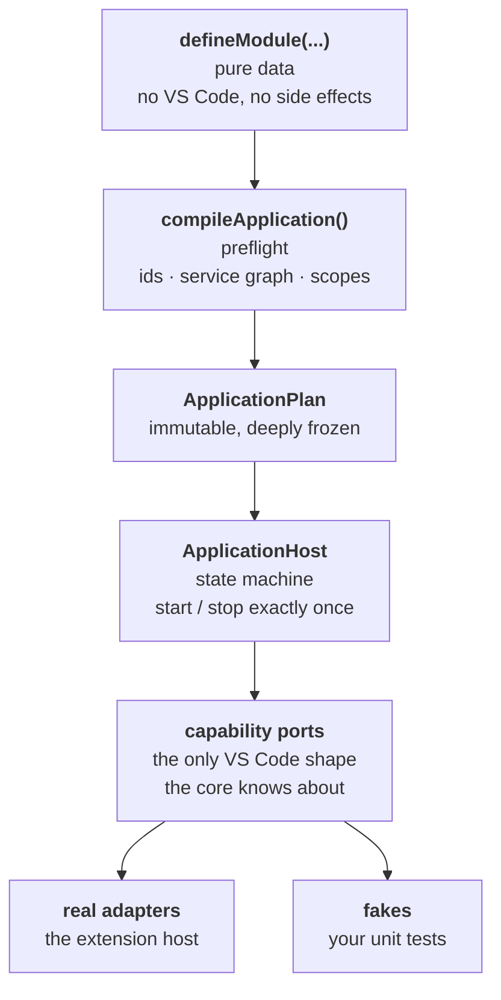

# Guide

Everything past the [quick start](../README.md#quick-start), one topic at a time.
Every code block on this page is a file under [`samples/`](samples) that
`npm run typecheck` compiles, so nothing here can go stale quietly.

Where each piece sits, before the details:



Everything on this page is one of those boxes. A declaration goes into a module;
a token comes back out of the container; the two sides at the bottom are why the
same code runs in a test and in the editor.

- [Ambient services](#ambient-services)
- [Settings](#settings)
- [Storage and secrets](#storage-and-secrets)
- [Hosted services and file watchers](#hosted-services-and-file-watchers)
- [Text editor commands](#text-editor-commands)
- [UI](#ui)
- [Views: trees and webviews](#views-trees-and-webviews)
- [Testing](#testing)
- [Diagnostics](#diagnostics)
- [Keeping package.json honest](#keeping-packagejson-honest)
- [The escape hatch](#the-escape-hatch)
- [Publishing an API](#publishing-an-api)

## Ambient services

Declaring the same three or four services on forty handlers is what pushes
people into bundling them behind one meaningless token. A module can declare an
ambient set instead: every handler in it receives that set merged under its own
`inject`, so they stay explicit, typed and preflight-checked while being written
once.

<!-- sample: docs/samples/ambient-services.ts -->

```ts
import {
  Editors,
  Localization,
  Log,
  Notifications,
  QuickInput,
  defineCommandContract,
  defineModule,
  type Injected,
} from '@kkdev92/vscode-ext-kit';

// The services every handler in this module reaches for. Declared once, as a
// value, so it can be both injected and turned into a type.
const uses = {
  logger: Log,
  notify: Notifications,
  ask: QuickInput,
  editors: Editors,
  l10n: Localization,
} as const;

// The resolved shape of that set. Deriving it means a token added above cannot
// drift from the interface a feature is written against -- the alternative is a
// hand-written interface that goes stale the first time someone is in a hurry.
type Services = Injected<typeof uses>;

// Features take the bundle and stay out of the module file, which is what keeps
// a module readable once it has forty commands in it.
async function renameSymbol(services: Services): Promise<void> {
  const name = await services.ask.text({ prompt: services.l10n.t('New name') });
  if (name === undefined) {
    return;
  }
  const editor = services.editors.active;
  if (editor === undefined) {
    await services.notify.error(services.l10n.t('Open a file first.'));
    return;
  }
  await editor.transformSelections(() => name);
  services.logger.info('renamed', { name });
}

export const Rename = defineCommandContract<readonly [], void>({ id: 'sample.rename' });

// Options second, so the module body does not gain a level of indentation.
// `defineModule(id, callback, options)` also works when you prefer it trailing.
export const editingModule = defineModule('editing', { uses }, (module): undefined => {
  // No `inject` here: the ambient set is already merged in, and naming one of
  // its members again is a definition-time error rather than a shadowing rule.
  module.commands.handle(Rename, (_context, _args, services) => renameSymbol(services));

  return undefined;
});
```

Services are excluded from the ambient set on purpose: a service's dependencies
_are_ the graph preflight validates, and an ambient entry there could hide one
or let a service depend on itself.

`notify`, `ask`, `l10n`, `editors`, `commands` and `status` are also on
`context` without being declared at all — `context.notify` resolves the same
token an `inject` would. Use the ambient set for everything else a module leans
on, and for features that take a bundle rather than a context.

## Settings

<!-- sample: docs/samples/settings.ts -->

```ts
import {
  defineCommandContract,
  defineModule,
  defineSettings,
  setting,
  SettingsValidationPolicy,
  type OperationContext,
} from '@kkdev92/vscode-ext-kit';

// One declaration fixes the keys, their types, their defaults and the
// contribution scope VS Code needs in package.json.
const ProjectSettings = defineSettings({
  section: 'sample.projects',
  policy: SettingsValidationPolicy.Lenient,
  values: {
    enabled: setting.boolean({ default: true, scope: 'resource' }),
    limit: setting.number({ default: 10, minimum: 1, maximum: 500 }),
    mode: setting.enum({ values: ['fast', 'thorough'], default: 'fast' }),
    exclude: setting.stringArray({ default: ['**/node_modules/**'] }),
    // "Unset" is a value. The manifest has to say `["integer", "null"]` before
    // VS Code will accept a null default, and `validate` has to let null
    // through or every read of a cleared setting falls back to the default —
    // this moves both halves at once.
    maxWidth: setting.nullable(setting.integer({ default: 1200 }), { default: null }),
  },
});

export const DescribeSettings = defineCommandContract<readonly [], string>({
  id: 'sample.describeSettings',
});

export const settingsModule = defineModule('settings', (module): undefined => {
  module.settings.add(ProjectSettings);

  module.commands.handle(DescribeSettings, {
    // The accessor is injectable under the definition's own token.
    inject: { settings: ProjectSettings.token },
    execute: (_context: OperationContext, _args, { settings }) => {
      // A read takes a scope, because VS Code resolves a different effective
      // value per resource and per language. `mode` is typed as the union.
      const values = settings.read().values;
      return `${values.mode}/${String(values.limit)}`;
    },
  });

  // A hosted service owns what it starts: `stop` runs in reverse declaration
  // order, inside the shutdown budget, and is the only place this subscription
  // is released.
  let subscription: { dispose(): void } | undefined;
  module.hostedServices.add({
    id: 'settings.watcher',
    inject: { settings: ProjectSettings.token },
    start: (context, { settings }) => {
      // Fires only when *this* key's effective value actually changed — a
      // sibling key moving in the same section does not wake it.
      subscription = settings.watch('enabled', undefined, (enabled) => {
        context.logger.info('projects toggled', { enabled });
      });
    },
    stop: () => {
      subscription?.dispose();
      subscription = undefined;
    },
  });

  return undefined;
});
```

Reading takes a scope, because VS Code resolves a different effective value per
resource and per language, and a language value outranks a _more local_
non-language value. An invalid configured value is never silently replaced:
`Strict` fails the read, `Lenient` falls back to the default **and** records a
diagnostic.

## Storage and secrets

<!-- sample: docs/samples/storage-and-secrets.ts -->

```ts
import {
  defineCommandContract,
  defineModule,
  defineSecret,
  defineStorage,
  s,
  type OperationContext,
} from '@kkdev92/vscode-ext-kit';

// Versioned, validated, migrated. A value written by an older build is upgraded
// on read and re-persisted; anything that fails validation falls back to
// `defaultValue` and is reported through `tryGet()` rather than thrown.
const RecentProjects = defineStorage({
  key: 'sample.recentProjects',
  scope: 'global',
  syncable: true,
  defaultValue: [] as readonly string[],
  schema: s.array(s.string()),
  version: 2,
  migrations: {
    // Version 0 is a plain value written before this kit was adopted.
    0: (old) => (typeof old === 'string' ? [old] : []),
    1: (old) => (Array.isArray(old) ? old.filter((entry) => typeof entry === 'string') : []),
  },
});

// A secret's value never appears in a log, a diagnostic or an error message --
// only its key does.
const ApiToken = defineSecret({ key: 'sample.apiToken' });

export const Remember = defineCommandContract<readonly [path: string], number>({
  id: 'sample.remember',
});

export const storageModule = defineModule('storage', (module): undefined => {
  module.storage.add(RecentProjects);
  module.secrets.add(ApiToken);

  module.commands.handle(Remember, {
    inject: { recent: RecentProjects.token, token: ApiToken.token },
    execute: async (_context: OperationContext, [path], { recent, token }) => {
      const next = [path, ...recent.get().filter((entry) => entry !== path)].slice(0, 10);
      await recent.set(next);

      // `read()` resolves to undefined when unset, so an absent secret is not an
      // error to handle at every call site.
      const secret = await token.read();
      return secret === undefined ? next.length : next.length + 1;
    },
  });

  return undefined;
});
```

Storage writes for one key are serialised, and a legacy key is deleted only after
the new one is committed, so an interrupted migration cannot destroy the only copy
of a value. Values are validated before they are stored as well as after they are
read — the read side falls back, so an unchecked write would fail nowhere at all.

Secrets are strict about disclosure: a schema failure reports the key, the vendor
and an issue count — never a message, a path or a value.

## Hosted services and file watchers

<!-- sample: docs/samples/hosted-service-and-watcher.ts -->

```ts
import { defineModule, serviceToken, type OperationContext } from '@kkdev92/vscode-ext-kit';

interface Cache {
  warm(): Promise<void>;
  invalidate(paths: readonly string[]): void;
}
const Cache = serviceToken<Cache>('sample.cache');

export const backgroundModule = defineModule('background', (module): undefined => {
  module.services.singleton(Cache, () => ({
    warm: () => Promise.resolve(),
    invalidate: () => undefined,
  }));

  // Async initialisation belongs in a hosted service, never in a service
  // factory: factories are synchronous so that resolution cannot deadlock.
  // Activation awaits `start`, and a throw here rolls the activation back.
  module.hostedServices.add({
    id: 'cache.warmup',
    inject: { cache: Cache },
    start: async (_context, { cache }) => {
      await cache.warm();
    },
  });

  // A background loop is started but not awaited. The host tracks it, so it is
  // never fire-and-forget, and `context.delay` resolves early on shutdown so a
  // sleeping loop cannot hold the budget hostage.
  module.hostedServices.background({
    id: 'cache.refresh',
    inject: { cache: Cache },
    run: async (context, { cache }) => {
      while (!context.signal.aborted) {
        await context.delay(30_000);
        if (context.signal.aborted) return;
        await cache.warm();
      }
    },
  });

  // Watcher batches arrive debounced and deduped, and each batch runs as an
  // operation: its own id, logger, cancellation signal and resource scope.
  module.fileWatchers.add({
    id: 'projects.files',
    patterns: ['**/*.project.json'],
    ignorePatterns: ['**/node_modules/**'],
    debounceDelay: 200,
    // Without a bound, a burst that never pauses is never delivered; with it,
    // the pending batch goes out at least this often.
    maxWait: 2_000,
    inject: { cache: Cache },
    handle: (context: OperationContext, events, { cache }) => {
      context.logger.debug('files changed', { count: events.length });
      cache.invalidate(events.map((event) => event.uri.fsPath));
    },
  });

  return undefined;
});
```

`module.fileWatchers.add` is for a glob known when the code is written. For one
the user just types, inject `FileWatchers` and call `watch` — same ability, one
entry for each of the two moments you can know the pattern.

## Text editor commands

<!-- sample: docs/samples/text-editor-commands.ts -->

```ts
import {
  defineCommandContract,
  defineModule,
  type ActiveEditor,
  type OperationContext,
} from '@kkdev92/vscode-ext-kit';

export const UpperCase = defineCommandContract<readonly [], void>({ id: 'sample.upperCase' });
export const Normalize = defineCommandContract<readonly [], void>({ id: 'sample.normalize' });

export const editorModule = defineModule('editor', (module): undefined => {
  // `handleTextEditor` hands the handler an `ActiveEditor` -- the same object
  // `Editors.active` returns -- so VS Code has already answered "is there an
  // editor?" before the body runs.
  module.commands.handleTextEditor(UpperCase, async (_context, editor) => {
    await editor.transformSelections((text) => text.toUpperCase());
  });

  module.commands.handleTextEditor(
    Normalize,
    async (context: OperationContext, editor: ActiveEditor) => {
      // Several edits, one undo step. The stages run in order, each seeing the
      // document the previous one left behind, and the whole run collapses into
      // a single Ctrl+Z -- which is why this is not a loop over `edit`.
      const applied = await editor.editStages([
        (current) =>
          current.selections.map((range) => ({ range, text: current.text(range).trimEnd() })),
        (current) =>
          current.selections.map((range) => ({
            range,
            text: current.text(range).split('\r\n').join('\n'),
          })),
      ]);
      context.logger.info('normalized', { applied });
    }
  );

  return undefined;
});
```

A text editor command is **fire-and-forget**, measured rather than assumed: VS
Code runs the handler inside `activeTextEditor.edit(...)` and discards its
result, logging a rejection rather than propagating it. So `commands.execute`
resolves `undefined` while the handler is still working. When a caller needs the
result or the failure, use `module.commands.handle` with `Editors.active`
instead.

It also does **not** grey the Command Palette entry out when no editor is open —
that is `enablement` / `commandPalette` `when` in `package.json`.

## UI

<!-- sample: docs/samples/ui.ts -->

```ts
import {
  defineCommandContract,
  defineModule,
  defineStatusBarItem,
  Notifications,
  QuickInput,
  type OperationContext,
  type PickItem,
} from '@kkdev92/vscode-ext-kit';

// Declared UI is created eagerly at activation and owned by the host: visible
// immediately, disposed on stop, no `context.subscriptions` bookkeeping.
const SyncStatus = defineStatusBarItem({
  id: 'sample.syncStatus',
  text: '$(cloud) Idle',
  command: 'sample.sync',
  tooltip: 'Sync projects',
});

export const Sync = defineCommandContract<readonly [], boolean>({ id: 'sample.sync' });

export const uiModule = defineModule('ui', (module): undefined => {
  module.statusBar.add(SyncStatus);

  module.commands.handle(Sync, {
    // Every UI surface arrives through a token, so all three are fakes in a
    // test with no VS Code anywhere.
    inject: { status: SyncStatus.token, notify: Notifications, ask: QuickInput },
    execute: async (context: OperationContext, _args, { status, notify, ask }) => {
      const items: readonly PickItem<'all' | 'changed'>[] = [
        { value: 'all', label: 'Everything' },
        { value: 'changed', label: 'Changed only' },
      ];
      // The signal is the operation's, so the picker closes when the command is
      // cancelled or the extension stops -- not only on Escape.
      const target = await ask.one(items, { title: 'Sync what?', signal: context.signal });
      if (target === undefined) {
        return false;
      }

      status.update('$(sync~spin) Syncing', 'Sync in progress');
      // Progress belongs to the operation: one session, cancellable, and tied to
      // the same signal the handler already has.
      await context.progress.run({ title: 'Syncing projects' }, async (reporter) => {
        reporter.report({ message: target.value, increment: 50 });
        await Promise.resolve();
      });
      status.update('$(cloud) Idle');

      await notify.info('Sync finished');
      return true;
    },
  });

  return undefined;
});
```

Declared UI (status bar, language status, tree views) is created eagerly at
activation, so it is visible without anything having to inject it first, and the
view is disposed before the provider it renders.

## Views: trees and webviews

<!-- sample: docs/samples/views.ts -->

```ts
import {
  BaseTreeDataProvider,
  defineCommandContract,
  defineModule,
  serviceToken,
  TreeItemCollapsible,
  Webviews,
  type ManagedWebview,
  type TreeItemData,
} from '@kkdev92/vscode-ext-kit';

interface FileNode extends TreeItemData {
  readonly path: string;
}

// A provider is plain logic: no `vscode` import, so a test drives it directly
// instead of through a mock of the platform.
class FileTree extends BaseTreeDataProvider<FileNode> {
  getRoots(): FileNode[] {
    return [
      {
        id: 'src',
        label: 'src',
        path: '/src',
        // A bare string is a theme icon id, which covers almost every row.
        icon: 'folder',
        collapsibleState: TreeItemCollapsible.Collapsed,
      },
    ];
  }

  getChildrenOf(element: FileNode): FileNode[] {
    return [
      {
        id: `${element.id}/index.ts`,
        label: 'index.ts',
        path: `${element.path}/index.ts`,
        icon: 'file',
      },
    ];
  }
}

const Tree = serviceToken<FileTree>('sample.fileTree');

export const OpenPreview = defineCommandContract<readonly [], void>({ id: 'sample.openPreview' });

export const viewsModule = defineModule('views', (module): undefined => {
  module.services.singleton(Tree, () => new FileTree());

  // Created at activation and disposed with the application. The view is
  // disposed before the provider it renders, so nothing renders into a
  // half-torn-down tree.
  module.treeViews.add({
    id: 'sample.files',
    inject: { tree: Tree },
    resolveProvider: ({ tree }) => tree,
    options: { showCollapseAll: true },
  });

  // A webview view is registered now and filled in when the user first opens
  // it — which is when VS Code asks for its content.
  module.webviews.addView<ManagedWebview>({
    id: 'sample.sidebar',
    options: { enableScripts: true },
    resolve: async (view) => {
      await view.setHtmlFromTemplate('media/sidebar.html', {
        title: 'Projects',
        cspSource: view.cspSource,
      });
    },
  });

  // A panel is opened from a handler through the injected service, and the
  // service is container-owned: a panel cannot outlive the extension.
  module.commands.handle(OpenPreview, {
    inject: { webviews: Webviews },
    execute: async (_context, _args, { webviews }) => {
      const panel = webviews.openPanel({ viewType: 'sample.preview', title: 'Preview' });
      await panel.setHtmlFromTemplate('media/preview.html', { title: 'Preview' });
    },
  });

  return undefined;
});
```

A tree provider is plain logic — no `vscode` import — so it is testable on its
own, and the adapter turns each row's plain data into the platform's `TreeItem`.
A webview view is registered at activation and resolved lazily; a panel comes
from the injected service, which the container owns, so a panel still open at
shutdown closes with everything else.

## Testing

The Test Host runs your **production plan** against fakes. Not a stub of your
extension: the same compiled plan, with one fake per capability port. Every fake
and its real adapter share a single contract suite, so a fake that drifts from
VS Code fails this repo's own build.

<!-- sample: docs/samples/testing.ts -->

```ts
import { serviceToken } from '@kkdev92/vscode-ext-kit';
import { createTestHost } from '@kkdev92/vscode-ext-kit/testing';

import { CountProjects } from './commands-and-services.js';
import { app } from './extension.js';

interface ProjectIndex {
  count(): number;
  rebuild(signal: AbortSignal): Promise<number>;
}
const ProjectIndex = serviceToken<ProjectIndex>('sample.projectIndex');

// The *production* plan, on fakes. Not a rebuild of it for testing: `app.plan`
// is the very object the extension host would run, and no VS Code module is
// loaded to get at it.

export async function countsProjects(): Promise<number> {
  const host = createTestHost({ plan: app.plan });
  await host.start();

  const count = await host.application.commands.execute(CountProjects);

  await host.stop();
  // Nothing left registered or undisposed: the assertion that catches a leak
  // introduced three refactors from now.
  const leaks = host.leaks();
  if (leaks.registrations !== 0 || leaks.resources !== 0) {
    throw new Error('the application leaked');
  }
  return count;
}

export async function countsWithAStubbedIndex(): Promise<number> {
  const host = createTestHost({
    plan: app.plan,
    // Replace one singleton; the rest of the graph is untouched, and the plan
    // itself is not modified.
    configureServices: (services) => {
      services.replaceSingleton(ProjectIndex, () => ({
        count: () => 99,
        rebuild: () => Promise.resolve(99),
      }));
    },
  });
  await host.start();

  const count = await host.application.commands.execute(CountProjects);

  await host.stop();
  return count;
}

export async function readsASetting(): Promise<void> {
  const host = createTestHost({ plan: app.plan });
  // Arrange a scoped value the way VS Code would resolve it, then report the
  // change with the leaf key VS Code actually reports.
  host.settings._set('sample.projects', 'enabled', 'globalValue', false);
  await host.start();
  host.settings._fireChange(['sample.projects.enabled']);
  await host.stop();
}
```

For code that talks to `vscode` directly, the kit also ships the low-level mock:

```ts
import { createVSCodeMock } from '@kkdev92/vscode-ext-kit/testing';
import { vi } from 'vitest';

vi.mock('vscode', () => createVSCodeMock(vi));
```

Or point Vitest's `resolve.alias` at the ready-made stand-in, which reaches
`dist/` bundles too — spread `vscodeExtKitVitestConfig` from
`@kkdev92/vscode-ext-kit/testing/vitest-config`.

The Test Host does not reproduce VS Code. Anything that depends on what VS Code
does _with_ what you hand it — rather than on what it hands back — needs a real
Extension Host test.

`host.leaks()` reports what the framework still owns after `stop()` — three
counts, and the assertion worth writing at the end of every host test. When one
of them is not zero, `host.inspect()` says what: the scope trees, naming the
module or operation that still holds an entry, plus the hosted services that
never stopped and the operations that never settled.

## Diagnostics

The framework narrates its own lifecycle. Pass `onDiagnostic` and you get every
transition as it happens: `application.starting` / `running` / `stopping` /
`stopped` / `failed`, `application.preflight.error` and `.warning`,
`module.binding` / `bound` / `failed` / `rollbackFailed`, `hostedService.*`,
`operation.started` / `completed` / `cancelled` / `failed`, and the
suppressions the notification and settings layers report.

<!-- sample: docs/samples/diagnostics.ts -->

```ts
import { defineExtension } from '@kkdev92/vscode-ext-kit';
import type { HostDiagnostic } from '@kkdev92/vscode-ext-kit';

import { projectsModule } from './commands-and-services.js';

/** The last few lifecycle events, for a "report an issue" command to attach. */
const recent: HostDiagnostic[] = [];

export const app = defineExtension({
  name: 'Sample',
  modules: [projectsModule],
  // Called synchronously as the host starts, binds modules, runs operations and
  // stops. Keep it cheap: it is not awaited, and an exception here is swallowed
  // rather than allowed to affect the lifecycle it is watching.
  onDiagnostic: (diagnostic) => {
    recent.push(diagnostic);
    if (recent.length > 100) {
      recent.shift();
    }
  },
});

/**
 * `application.shutdownTimeout` is the one worth reading first.
 *
 * It means the stop budget ran out and the remaining work was abandoned rather
 * than awaited. `details` says which phase ran out, how long it waited, which
 * hosted service was inside its `stop`, which operations never settled, and
 * which resource scopes still held entries — ids and counts, never arguments
 * or payloads.
 */
export function unfinishedAtShutdown(): readonly HostDiagnostic[] {
  return recent.filter((diagnostic) => diagnostic.event === 'application.shutdownTimeout');
}
```

The event name is a string and `details` is plain data, so this is a stream to
log, count or attach to a bug report — not an event bus. Delivery is
best-effort by design: a listener that throws is ignored, and nothing waits for
one.

### When preflight says no

Preflight is the other place the framework tells you something went wrong, and
it does so by throwing: `defineExtension` at import time for a structural
problem, `activate` for a host that does not meet a module's requirements. The
error is a `PreflightError`, and it carries every problem it found rather than
the first — each with a stable `code`, the `subject` it is about and, where a
module declared it, the `moduleId`.

<!-- sample: docs/samples/preflight.ts -->

```ts
import { PreflightError } from '@kkdev92/vscode-ext-kit';

/**
 * Turns a preflight failure into lines a person can act on.
 *
 * `defineExtension` throws before VS Code is touched, with every problem it
 * found rather than the first. Each problem carries a stable `code` — for a
 * script or a test to branch on — and a `message` that says the same thing to
 * a person. Anything else is rethrown untouched.
 */
export function explainPreflight(error: unknown): readonly string[] {
  if (!(error instanceof PreflightError)) {
    throw error;
  }
  return error.problems.map((problem) =>
    problem.moduleId === undefined
      ? `${problem.code}: ${problem.message}`
      : `${problem.code} in ${problem.moduleId}: ${problem.message}`
  );
}

/**
 * The one check a CI step usually wants: did the graph change shape?
 *
 * A captive dependency — a singleton holding a transient — is the kind of
 * mistake that only shows up as a stale value weeks later. Preflight reports
 * it at import time, and the code makes it a one-line gate.
 */
export function holdsATransientCaptive(error: unknown): boolean {
  return (
    error instanceof PreflightError &&
    error.problems.some((problem) => problem.code === 'SERVICE_CAPTIVE_DEPENDENCY')
  );
}
```

The message still lists every problem as a sentence, so nothing changes for a
reader of the console. The codes are for everything else: a test that asserts a
plan is well-formed, a CI step, an editor integration. They are listed on
`compileApplication` and on `RuntimeIssue`.

`application.shutdownTimeout` deserves the special attention above because it is
the one event that reports something the framework could not do. VS Code races
every extension's deactivation against a few seconds and then exits; the
framework's own budget sits inside that, and past it pending work is abandoned.
Knowing _which_ work is the difference between a mystery and a fix.

### The plan, as data

Diagnostics say what is happening; `describePlan` says what was declared. It
turns a compiled plan into JSON — module ids, service tokens and the edges
between them, command ids and titles, settings keys and defaults, watcher
globs, view ids — with nothing callable in it.

<!-- sample: docs/samples/describe-plan.ts -->

```ts
import { describePlan } from '@kkdev92/vscode-ext-kit';

import { app } from './extension.js';

/**
 * What this extension registers, as JSON.
 *
 * Commit the output and a pull request shows the topology change beside the
 * code change: a new command, a service that gained a dependency, a watcher
 * whose glob moved. Deterministic, so a diff means a declaration changed.
 */
export function planAsJson(): string {
  return JSON.stringify(describePlan(app.plan), null, 2);
}

/** Every command in the plan, with the module that declared it. */
export function commandOwners(): readonly string[] {
  return describePlan(app.plan).commands.map((command) => `${command.id} (${command.moduleId})`);
}

/**
 * The service graph as edges, which is most of what a dependency diagram is.
 *
 * Token ids, not token objects: the description carries nothing callable, so
 * there is nothing here to resolve or mutate.
 */
export function serviceEdges(): readonly string[] {
  return describePlan(app.plan).services.flatMap((service) =>
    Object.values(service.dependencies).map((dependency) => `${service.token} -> ${dependency}`)
  );
}
```

It is deterministic and in declaration order, so the output is worth
committing: a diff in the file means a declaration changed, which is the
review question `git diff` on a large module rarely answers directly. The same
document is what a manifest cross-check and a dependency diagram want, and it
is the honest answer to "what does this extension actually register?" for
anyone — or anything — reading the codebase for the first time.

Secret _keys_ appear, because a declared key is metadata the source already
states in the clear. Secret values do not exist at plan time.

## Keeping package.json honest

VS Code reads the manifest before any extension code runs, so `src` and
`package.json` can never collapse into one file. What overlaps is small and
mechanical, and this is the check that keeps it from drifting.

<!-- sample: docs/samples/manifest.ts -->

```ts
import { defineCommandContract, defineSettings, setting } from '@kkdev92/vscode-ext-kit';
import { assertManifestMatches } from '@kkdev92/vscode-ext-kit/testing';

// VS Code reads package.json before any extension code runs, so the manifest
// and `src` can never collapse into one file. What overlaps is small and
// mechanical -- ids, types, defaults, enum values, scopes -- and this is the
// check that keeps the two from drifting apart there.
const Settings = defineSettings({
  section: 'sample',
  values: {
    limit: setting.number({ default: 10, minimum: 1 }),
    mode: setting.enum({ values: ['fast', 'thorough'], default: 'fast' }),
  },
});

const Contracts = {
  Refresh: defineCommandContract<readonly [], void>({ id: 'sample.refresh' }),
  Clear: defineCommandContract<readonly [], void>({ id: 'sample.clear' }),
};

// Call this from whichever test runner you use, with the parsed package.json
// (`JSON.parse(readFileSync('package.json', 'utf8'))`). It has no runner
// dependency of its own, and it throws once -- naming every disagreement and
// printing the JSON to paste, so the fix is always "update the manifest".
export function checkManifest(manifest: unknown): void {
  assertManifestMatches(manifest, {
    settings: [Settings],
    commands: Object.values(Contracts),
    views: ['sample.projects'],
  });
}
```

Nothing is generated in either direction. Generating TypeScript from the
manifest cannot produce the argument types a command contract exists for, and
generating the manifest from TypeScript turns `package.json` into a file a human
still has to hand-edit. Verifying the overlap costs one test and leaves both
files written by the people who own them.

## The escape hatch

<!-- sample: docs/samples/raw-registration.ts -->

```ts
import * as vscode from 'vscode';

import { Localization, defineModule } from '@kkdev92/vscode-ext-kit';

// The escape hatch, for a VS Code API this package has no model for. A hover
// provider is the case that earns one: there is no declaration for it, and
// inventing a general-purpose model to register a single provider would be the
// worse trade.
//
// What `raw.register` buys over calling `vscode` from anywhere is that the
// registration stays owned -- it goes into the module's scope, unwinds through
// the same `deactivate`, rolls back if activation fails later, and shows up in
// the compiled plan instead of hiding in a feature file.
export const hoverModule = defineModule('hover', (module): undefined => {
  module.raw.register({
    id: 'sample.wordCountHover',
    inject: { l10n: Localization },
    bind: ({ registrations, logger }, { l10n }): undefined => {
      // `own` takes the platform's disposable. Nothing else has to remember it.
      registrations.own(
        vscode.languages.registerHoverProvider(
          { scheme: 'file' },
          {
            provideHover(document, position) {
              const range = document.getWordRangeAtPosition(position);
              if (range === undefined) {
                return undefined;
              }
              const word = document.getText(range);
              logger.trace('hover', { length: word.length });
              return new vscode.Hover(l10n.t('{0} characters', String(word.length)), range);
            },
          }
        )
      );
      // Synchronous by contract: activation binds modules transactionally, so a
      // bind that returned a promise could still be mutating a scope after that
      // transaction committed. A thenable return is rejected at runtime too.
      return undefined;
    },
  });

  return undefined;
});
```

The goal is not that no code outside the framework exists — it is that every
place you left it is searchable, owned, and unwound with everything else.

## Publishing an API

Some extensions are consumed by other extensions. The built-in Markdown preview
reads `extendMarkdownIt` off a plugin extension; anything else reads
`extensions.getExtension(id).exports`. Either way VS Code takes the value from
whatever `activate` resolves to.

That value is normally built from services, and services do not exist until the
application has started — so without a declaration the only way to produce one
is a mutable module variable that a hosted service fills and `activate` reads
back, hoping it did. `exports` is that declaration: the framework builds the
value after every hosted service has started, from the same instances the rest
of the application got, and resolves `activate` to it.

<!-- sample: docs/samples/extension-api.ts -->

```ts
import { defineExtension } from '@kkdev92/vscode-ext-kit';

import { CountProjects, ProjectIndex, projectsModule } from './commands-and-services.js';

// Some extensions publish an API: another extension reads it off
// `extensions.getExtension(id).exports`, and the built-in Markdown preview
// reads `extendMarkdownIt` the same way. VS Code takes it from whatever
// `activate` resolves to.
//
// That value has to be built from services, and services do not exist until the
// application has started -- so declaring it is what lets the framework build it
// at the one moment it can. `create` runs after every hosted service has
// started, with the same instances everything else got.
export const app = defineExtension({
  name: 'Sample',
  modules: [projectsModule],
  exports: {
    inject: { index: ProjectIndex },
    // No annotations: `index` is typed from `inject`, and `activate` resolves to
    // whatever this returns.
    create: ({ index }) => ({
      count: (): number => index.count(),
      rebuild: (signal: AbortSignal): Promise<number> => index.rebuild(signal),
    }),
  },
});

// Resolves to `{ count(): number; rebuild(signal): Promise<number> }`.
export const activate = app.activate;
export const deactivate = app.deactivate;

export const countProjects = (): Promise<number> => app.commands.execute(CountProjects);
```

Nothing else gains access to the container. The framework resolves the
declaration; a service is still reachable only where it was declared.
